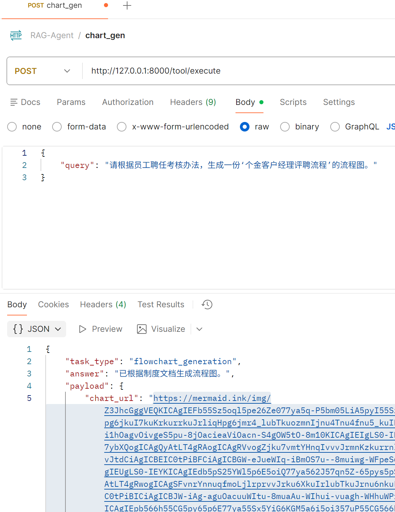

# Enterprise-level Agent Knowledge Base Assistant

## packages:
    see requirements.txt

## instruction:
    An intelligent agent assistant that supports knowledge retrieval, summary generation, and flowchart generation 
    with multi-turn conversation capabilities. The system features a complete frontend-backend architecture with a 
    Gradio web interface and FastAPI backend.

### Key Features
- **Multi-turn Conversations**: Maintains context across conversation turns
- **Document Processing**: PDF upload and knowledge base integration
- **Flowchart Generation**: Creates visual flowcharts from documents
- **Knowledge Retrieval**: Advanced RAG-based information retrieval
- **Web Interface**: User-friendly Gradio frontend with DeepSeek-style design

### Architecture
- **Backend**: FastAPI with agent orchestration, session management, and RAG pipeline
- **Frontend**: Gradio web interface with modular components
- **Storage**: Vector database for document embeddings
- **Logging**: Unified logging system for monitoring and debugging

## run
### Prerequisites
1. Install required packages:
    ```bash
    pip install -r requirements.txt
    ```

2. Start the backend service:
    ```bash
    python app/main.py
    ```
    The backend will start at `http://localhost:8000`

3. Start the frontend interface:
    ```bash
    python start_frontend.py
    ```
    The frontend will be available at `http://localhost:7860`

### Usage Steps
1. **Upload Documents**: Navigate to the "Document Upload" tab and upload PDF files
2. **Start Conversation**: Switch to the "Chat" tab and begin asking questions
3. **Multi-turn Dialog**: Continue the conversation with context-aware responses
4. **Generate Flowcharts**: Request flowchart generation from uploaded documents


## result



## Visit
    Coming soon, stay tuned!